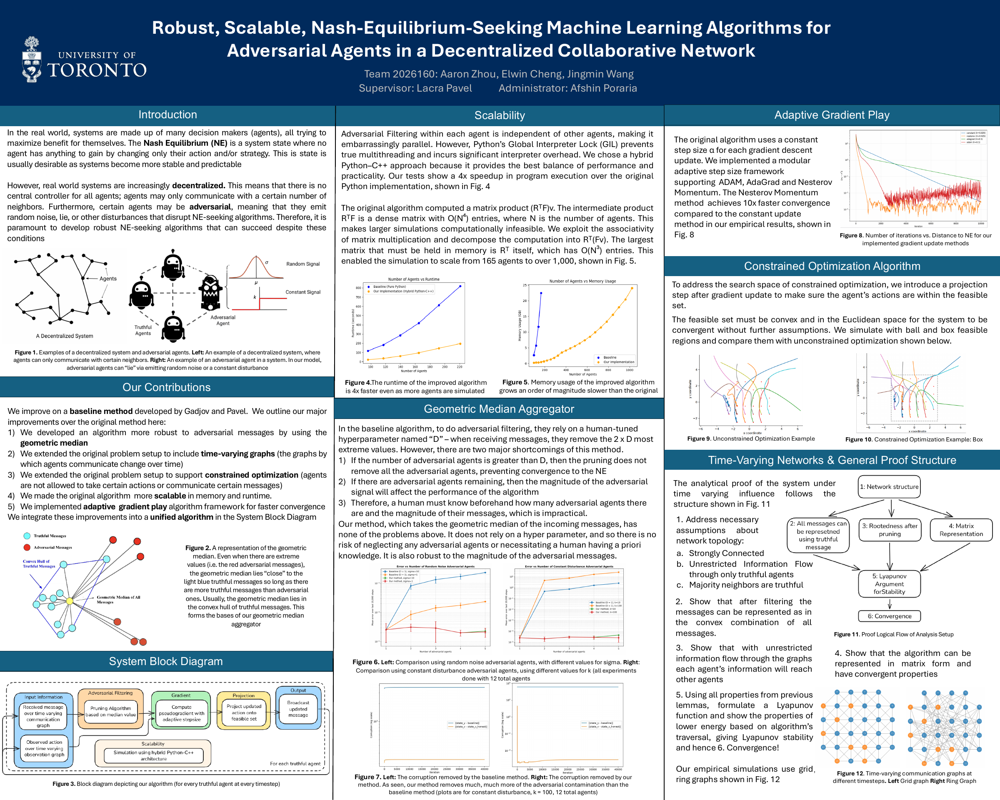

# Robost-Scalable-Nash-Equilibrium-Seeking-Algorithms

**Adversary-resilient and scalable gradient-play algorithms for time-varying multi-agent systems**

**[View the full research poster (PDF)](poster.pdf)**

## Research overview

In a decentralized multi-agent system, decision-making agents optimize their own objectives while exchanging information only with neighboring agents. A central goal is to reach a **Nash equilibrium (NE)**, at which no agent can improve its outcome through a unilateral change in strategy. In practice, the communication network may change over time, agents may be restricted to feasible actions, and some participants may transmit adversarial messages (such as random noise or constant disturbances).

This research extends a decentralized NE-seeking method by Gadjov and Pavel to address these challenges while improving the computational cost of simulating larger networks.

## Research problem

The baseline approach filters extreme neighbor messages using a manually selected parameter, `D`. If this parameter underestimates the adversarial agents in a neighborhood, corrupted messages may remain and impede convergence. Its constant-step-size gradient updates can also converge slowly, while a dense intermediate matrix in its implementation makes larger simulations memory-intensive. We investigate how to make decentralized NE seeking **more robust to adversarial messages, adaptable to changing network topologies and action constraints, and practical at larger scales**.

## Approach

- **Robust message aggregation:** Replace the baseline's `D`-dependent extreme-value pruning with a **geometric-median aggregator** to reduce the influence of corrupted neighbor messages without requiring the user to specify the number of adversaries for the pruning rule. The analysis considers conditions including a truthful majority among neighbors and information flow through truthful agents.
- **Time-varying communication:** Extend the setup to changing communication graphs, including simulated grid and ring networks, and outline a convergence analysis based on network assumptions and Lyapunov stability.
- **Constrained gradient play:** Project gradient updates onto a convex feasible region; experiments illustrate ball- and box-constrained action spaces.
- **Faster gradient updates:** Implement a modular framework supporting Adam, AdaGrad, and Nesterov momentum in addition to constant-step-size gradient play.
- **Scalable implementation:** Use a hybrid Python–C++ implementation for message filtering, and evaluate the associative matrix product as `Rᵀ(Fv)` instead of forming the dense intermediate `(RᵀF)v`.

## Quantitative results

| Metric | Poster-reported result |
| --- | --- |
| Much Improved Error | Reduced distance to NE by over **100000** times compared with baseline for settings with more adversarial agents |
| Much Improved Corruption Removal | Reduced corruption in outgoing messages by **100000** times compared with baseline |
| Enables Time Varying and Constrained Networks | Our method works in constrained optimization scenarios with time-varying networks |
| Gradient-play convergence | **10× faster convergence** with Nesterov momentum than the constant-step-size update in the reported experiment. |

These figures are results reported in the poster, not guarantees for every network, adversarial configuration, or hardware setup.

## Research team

**Aaron Zhou · Elwin Cheng · Jingmin Wang**  
**Supervisor:** Prof. Lacra Pavel  
**Institution:** University of Toronto

## Poster

[Open or download the full-resolution poster](poster.pdf). Click the preview image at the top of this README to open the PDF.
